https://www.youtube.com/live/6GAdqOZx9z0?si=xtSClfd4vfz0c5kL

Основные идеи в докладе:
- Тесты это тоже код.
- Любой код со временем становится только сложнее.
- Сложность можно нивелировать вводя абстракции.

Простой пример простейшего теста. Уже видны все основные этапы AAA:
- Arrange
- Act
- Assert

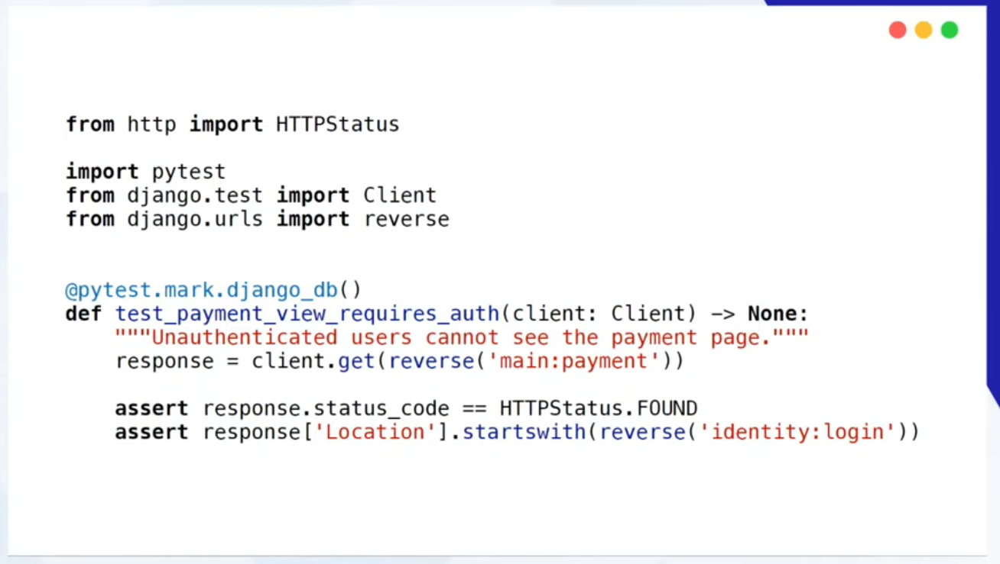

Рассмотрим как постепенно усложняются тесты. Вот пример тестирования 
рендеринга страницы регистрации.

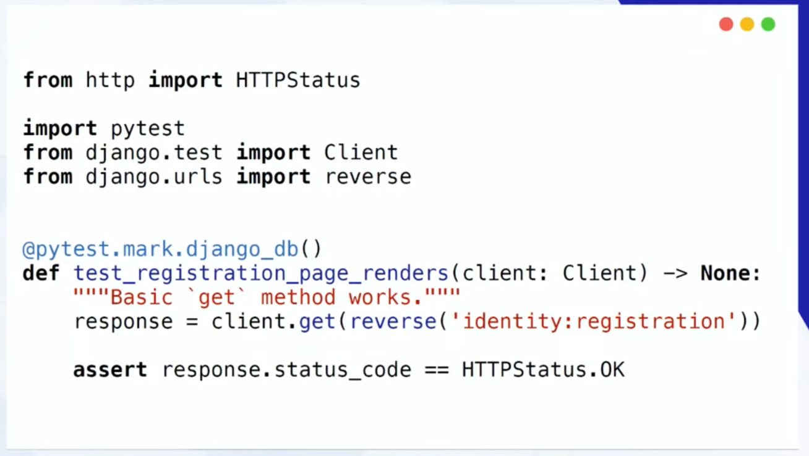

А теперь рассмотрим тест самой регистрации:

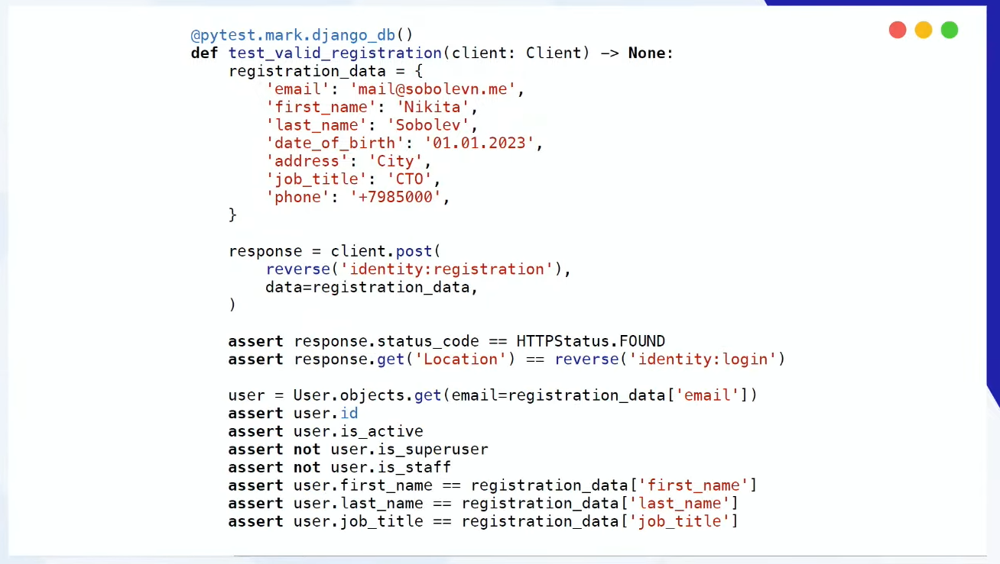

Соответственно здесь нам надо сгенерировать кучу данных которые вводит пользователь
и проверить их и то что создала сама система. И здесь есть ряд вопрос: обязательно ли
год рождения должен быть таким. Может ли зарегистрироваться только CTO или нет. Можно ли
зарегистрироваться с другим номером телефона и тд. А еще мы не проверяем что сохранился адрес.
А еще не проверяем сохранился ли номер телефона.

Решение как убрать сложность: разнести ее по функциям. Отдельно создаем фабрику случайных данных

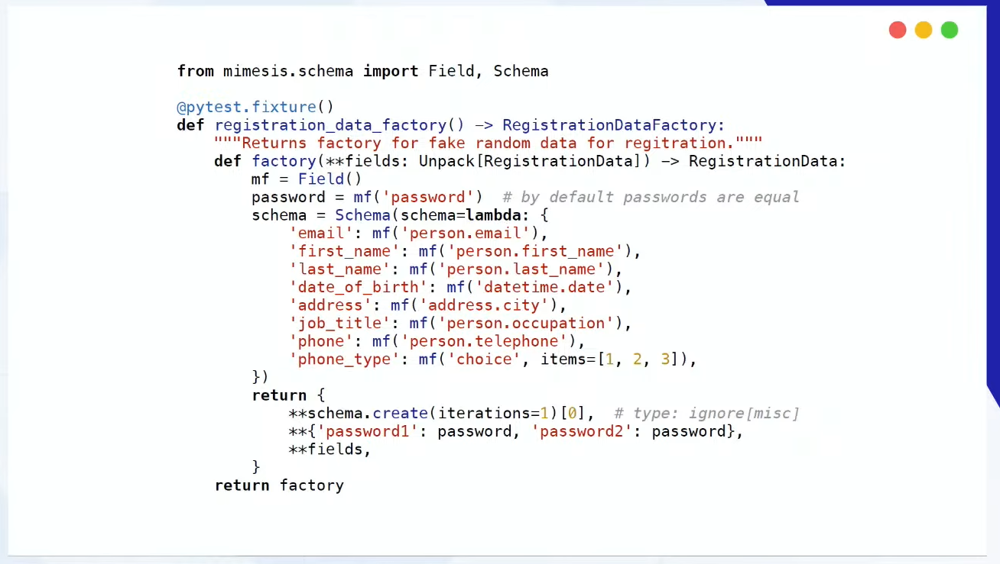

Описываем схему данных этой фабрики: Что она принимает и что возвращает.

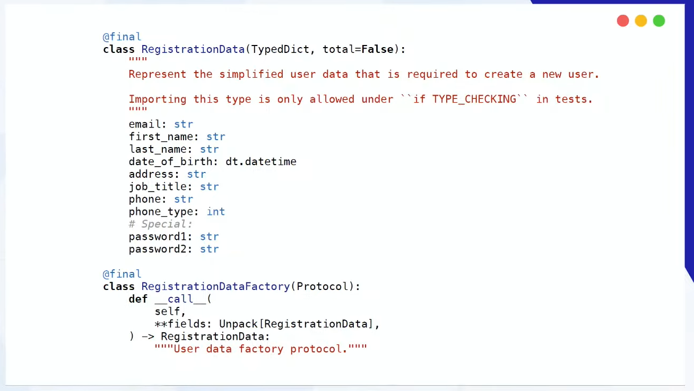

А чтобы не вызывать пачку вложенных функций сделаем фикстуру с данными по-умолчанию:

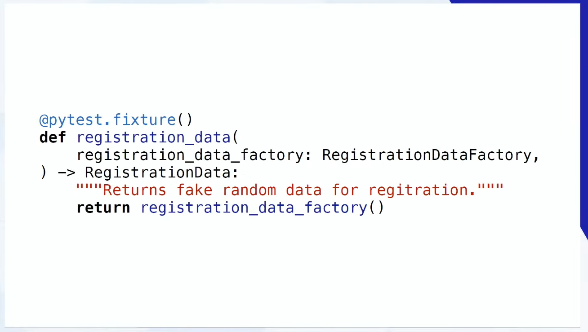

С генерацией данных разобрались и теперь уберем ассерты.

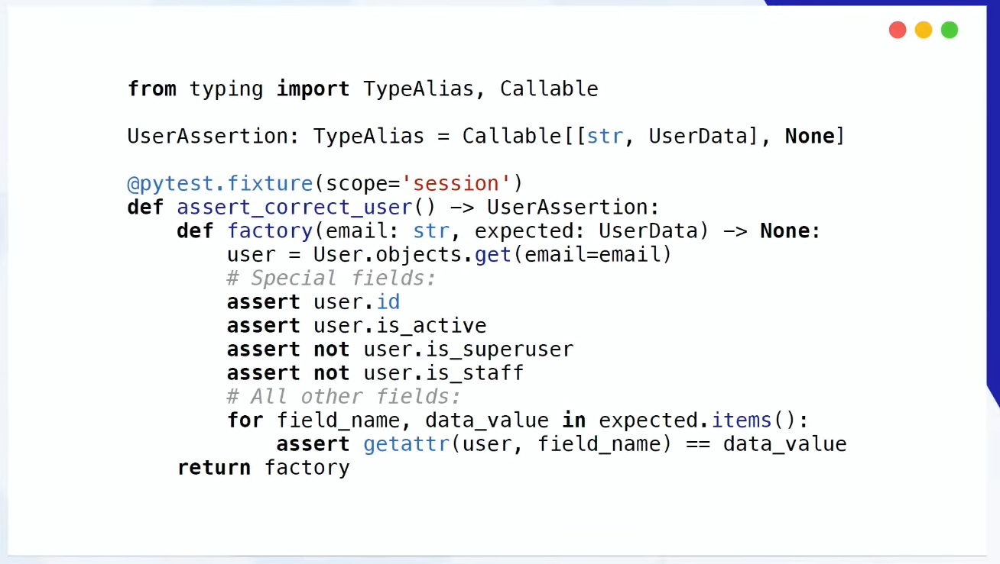

Нюанс в том что чтобы получить ожидаемые из сгенерированных данных. Для этого нужно написать фабрику-преобразователь/конвертер.

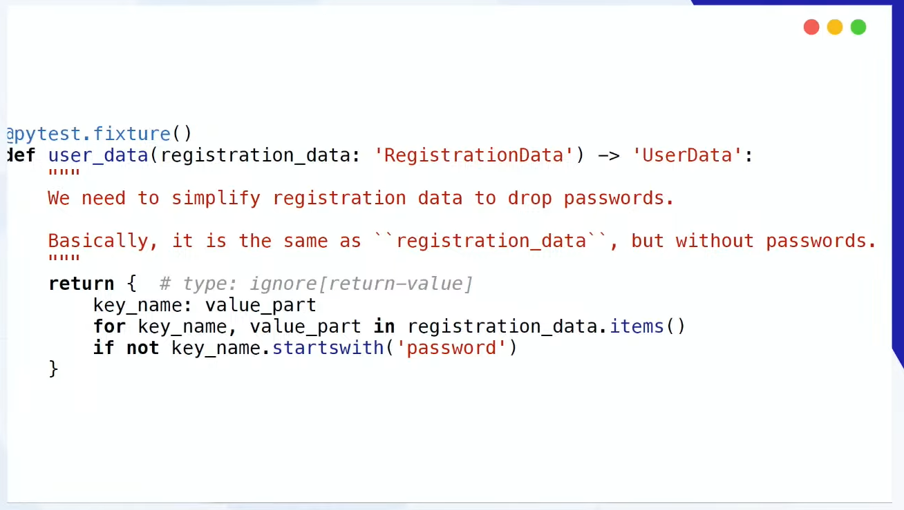

Соответственно фабрика user_data принимает регистрационные данные (RegistrationData) и возвращает их преобразованный вариант: UserData.
Далее делаем к этой фабрике пару протоколов:

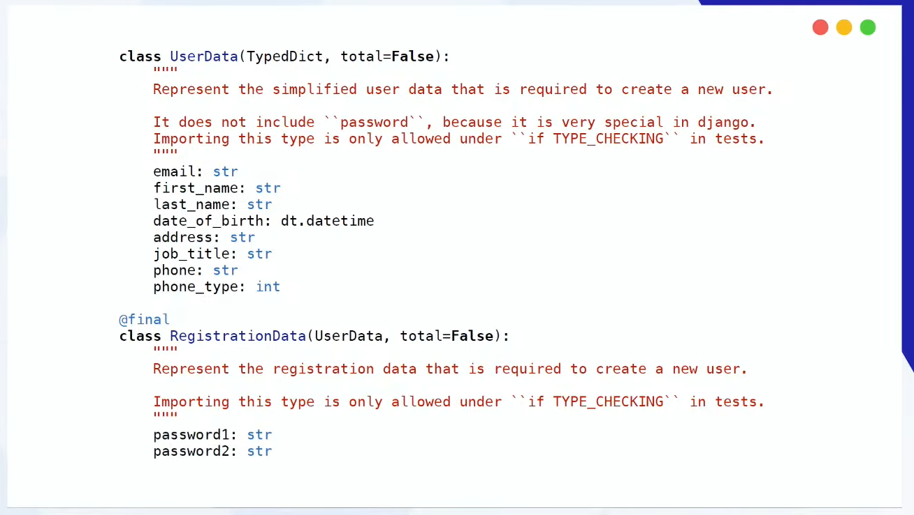

Обратите внимание: мы изменили реализацию RegistrationData отнаследовав от UserData
Итог:

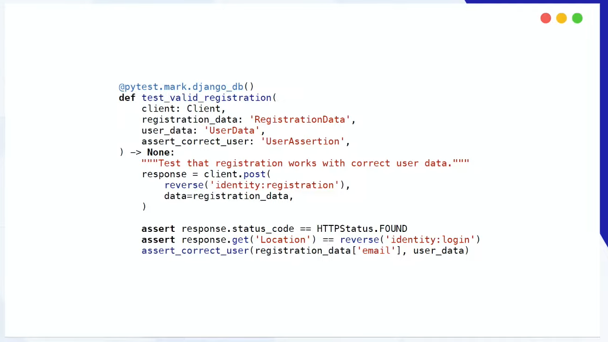

Получившийся код может расширяться. Вернемся к фабрике регистрационных данных. 

И допустим у нас будет 2 типа пользователей. Один такой полный, а другой зарегистрировался по промоакции и у него никаких полей нет. 
Но при этом они будут работать одинаково. Тогда мы параметризуем тест инструментами pytest и определяем такую фабрику
нового пользователя:

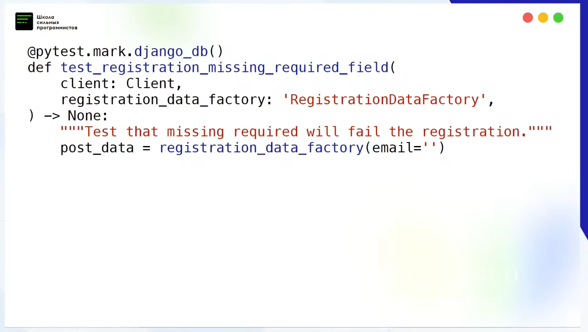

Теперь более реальный пример с использованием API. Допустим нам надо замокать внешний сервис. Мы модифицировать старую фикстуру
или написать новую:

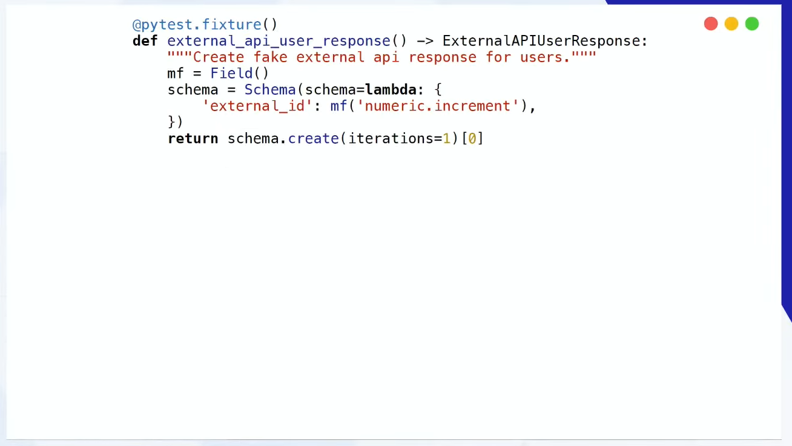

Затем пишем мок внутри фикстуры:

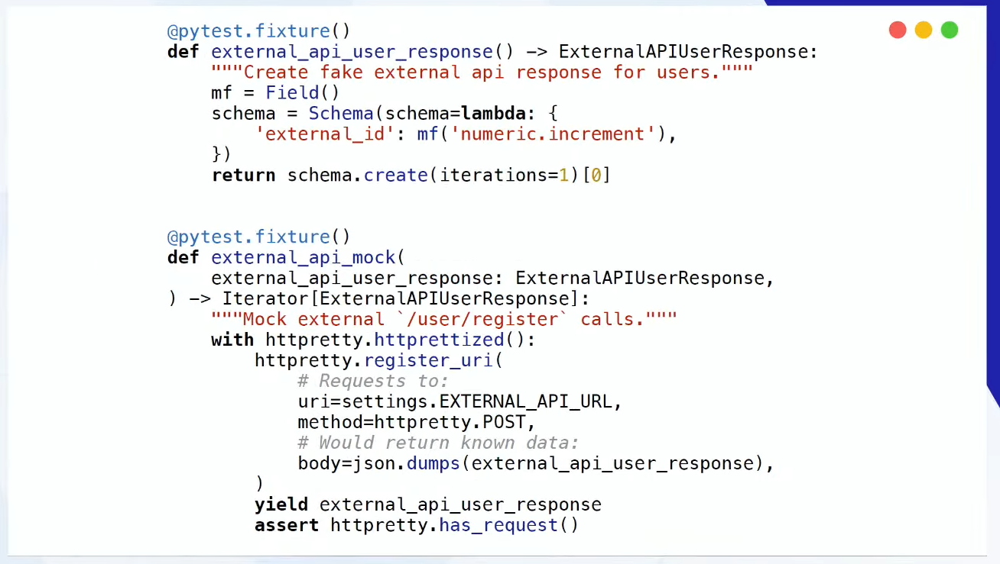

httpretty - специальная библиотека для мока веб-сокетов.

Итог:

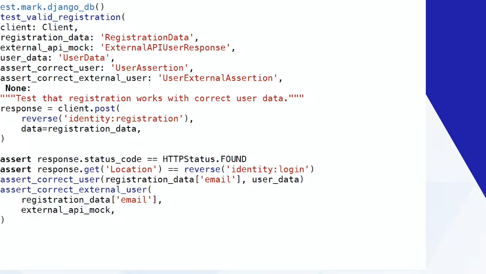

education.borshev.com/python-testing